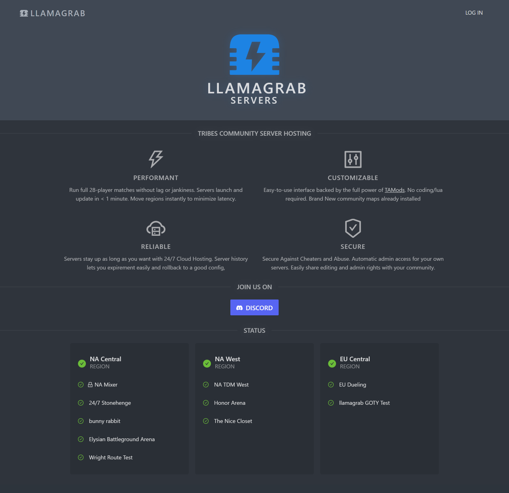
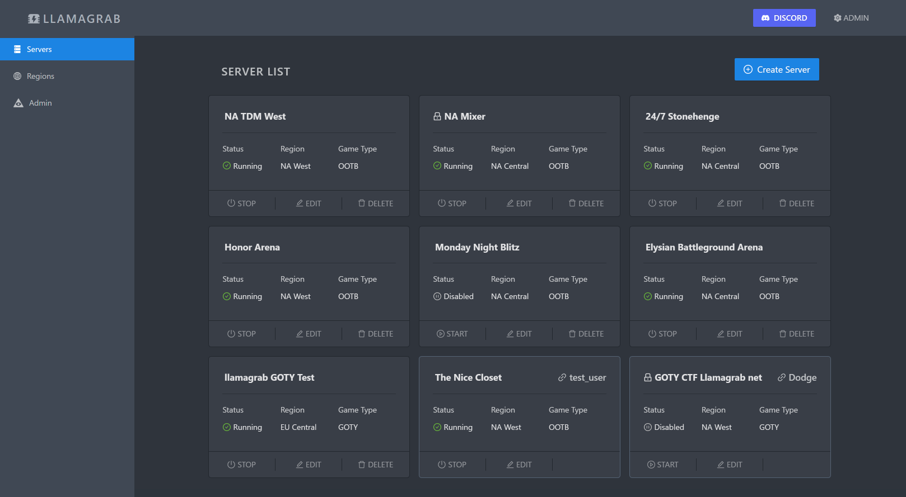
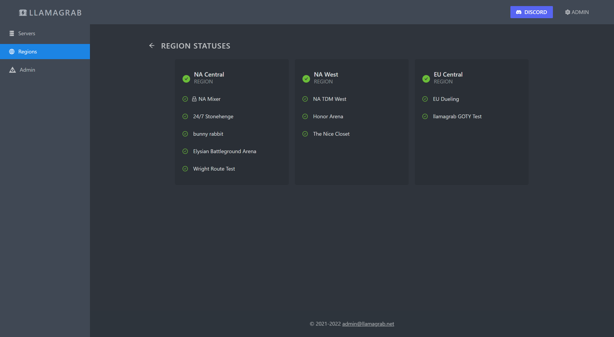
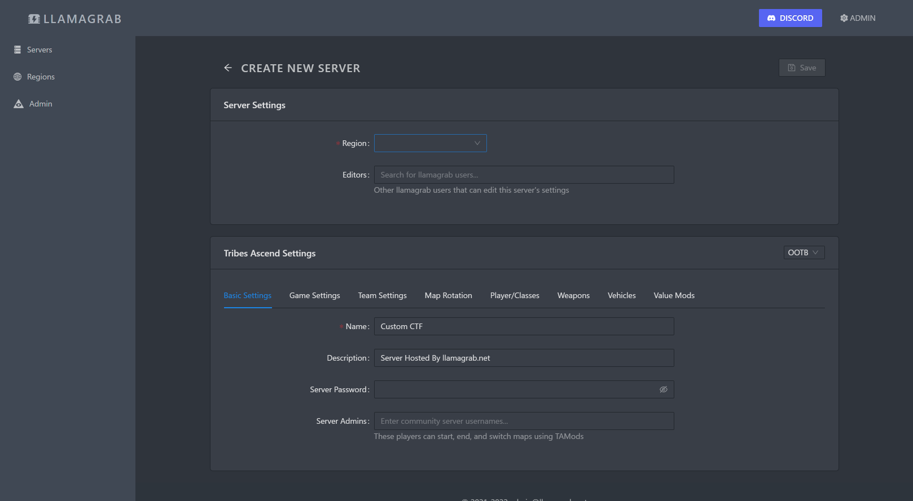
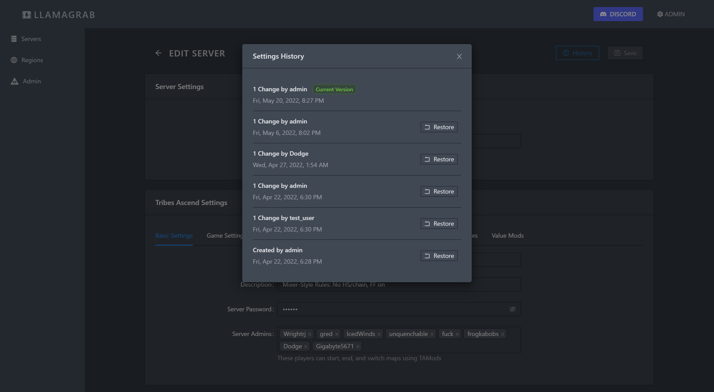
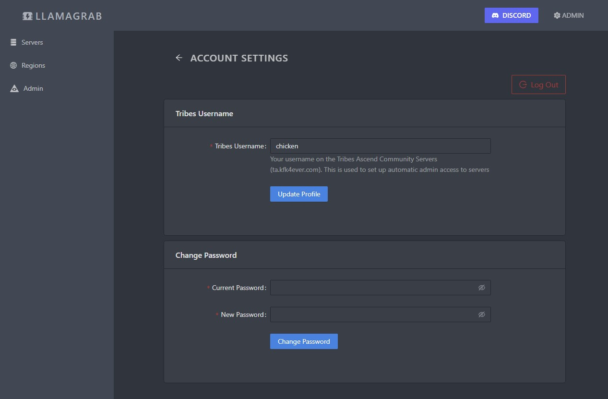
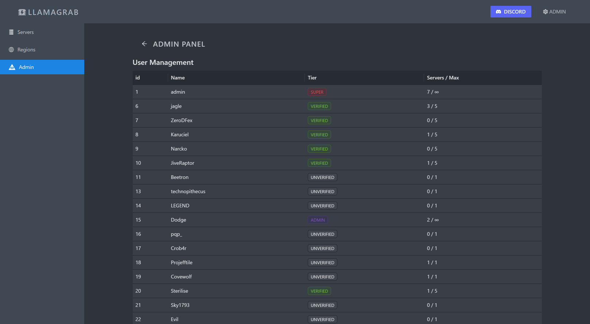
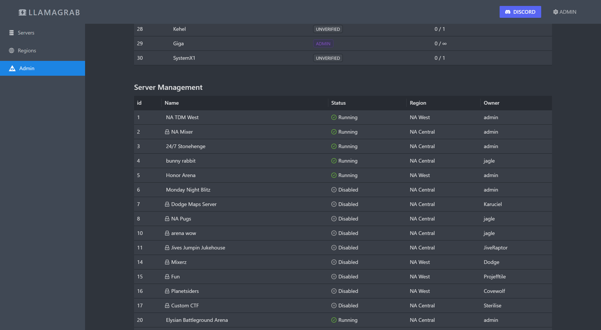
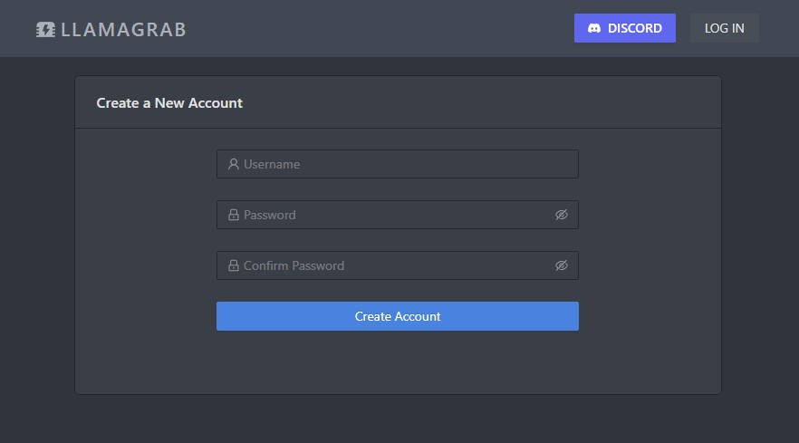

# llamagrab-web
Web UI for llamagrab. Main interface for users to create and manage servers. Communicates with llamagrab API only.

The interface is mainly targeted for desktop use, but aims to be fully functional on mobile.

It is built using:
* [React](https://reactjs.org/)
* [Typescript](https://www.typescriptlang.org/)
* [ant-design](https://ant.design/)

This project was bootstrapped with [Create React App](https://github.com/facebook/create-react-app).

### Run Locally

Start live-reloading mode. Open [http://localhost:3000](localhost:3000).
It will attempt to use llamagrab-api at http://localhost:8000. This is configurable as `proxy` in package.json
```
yarn install
yarn start
```

### Run tests
```
yarn test
```

### Build
```
yarn build
```
files will be in `build/`

### Deployment
For deployment, the web app is built statically with `yarn build` and served by the llamagrab-api python app on `/`. This is mainly to simplify deployment and packaging for now.

## Notes

### Code

* `public/` - index.html, images, static assets
* `src/` - TS/JS code
  * `components/` - core UI components
  * `editor/` - UI components for the game server editing forms
  * `pages/` - components which correspond to the top-level pages/navigation
  * `App.tsx` - Top level component for the app (contains routing)
  * `api.ts, domain.ts` - API queries and type definitions
  * `App.less, colors.ts` - main CSS / color theme settings

The web app also depends on resources in `llamagrab/common`, mostly for JSON data about game options (weapons, maps, value mods, etc)

### Design
The design of the app relies almost entirely on [antd](https://ant.design/) components with a minimal amount of styling/color scheme applied on top. Colors should be used sparingly to indicate actions or status.

All UI elements should be designed first for desktop use (`md` breakpoint or larger), but should be responsive and usable on mobile. For small screens, breakpoints are used to hide less critical information, shorten/remove some text.


#### Images
- gen.svg is a trace of the TA generator icon
- gen_aligned.svg in sligthly modified gen.svg to align better with 16x16 favicon pixel boundaries

##### Updating favicons

1. Render `web/public/gen_aligned.svg` as a 512x512 PNG
2. Upload `gen_aligned.png` to [favicon.io](https://favicon.io/favicon-converter/)
3. Extract result to `web/public/icon/`

## Screenshots (6/12/2022)
|  | | |
| --- | --- | --- |
| Landing Page  | Home Page / Server List  | Region status page 
| Server editor  | Server history  | Account settings 
Admin (users)  | Admin (servers)  | Signup page 